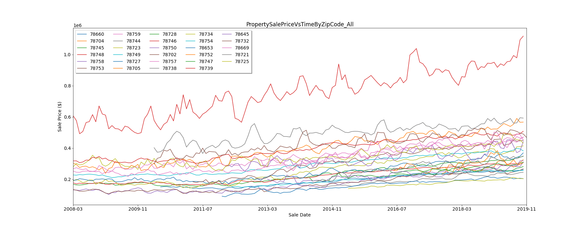
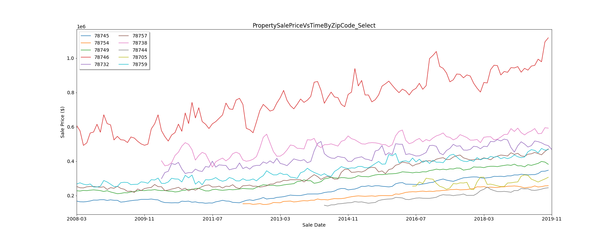
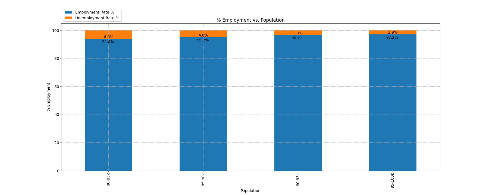

# Project 1  
## Data analytics and visualization project  
### Team Members
* Hongmei Zeng  
* Noah Stettler  
* Patrick Harrington  
* Yacub Bholat  

## Background and Expected Results
Austin has seen explosive growth over the last several years. We will seek to answer the following questions.
* How has the *population* grown?  
  * Population has visibily gone up, so we expect to see a healthy upward trend in population over time.  
* How have *housing* prices changed?  
  * We believe the supply of housing has not kept up with the demand for it, so we expected to see housing prices increase over time.  
* How has *employment* been affected?  
  * Austin's job market appears to be healthy, so we expect to see unemployment to decrease over time.
* How have the *demographics* changed?  
  * We expect to see Austin's population become more diverse over time.

## Data Sources  
* U.S. Census Bureau  
* U.S. Bureau of Labor Statistics  
* Zillow Research - Median Sale Price by Zip Code  
* Slipstream Home Junction API - Austin Zip Codes  
  * Link to get a trial key: https://homejunctioninc.lpages.co/slipstream-api-postman-collection/

## Results  
### Population Growth
* Based on the plot below, population has been steadily increasing with time.  

### Home Sale Price
  * Based on the plots below, home sale prices have been steadily increasing with time.  
  

  * The plot below illustrates the mean *change* in home sale price across all homes in Austin for any given *month*. Based on this, May would generally be the best time to buy a home in Austin, following by April.  
.png)

### Employment Data
* The plot below illustrates (i) the number of people who are employed and (ii) the size of the labor force (i.e., employed or looking for a job).  

### Demographic Data

### Population vs. Housing
* The plot below illustrates the effect of population on home prices. As demand outstrips supply and as Austin becomes a more attractive place to live, average home prices have increased.  

### Population vs. Employment
* The bar chart below illustrates employment rates vs. population. This chart demonstrates that Austin has a healthy job market and that many people may be moving to Austin for new jobs.  
